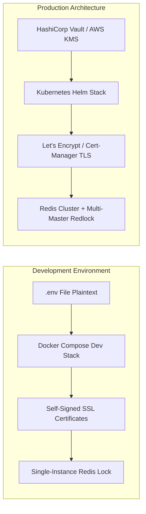

# 🛡️ Production Readiness Review — National Cyber Threat Intelligence Platform

## Executive Summary
This document outlines the architectural differences between the current development setup and a full production deployment.

---

## Key Production Deployment Differences

### 1. Secrets Management
- **Dev Setup**: Environment variables in `backend/.env`.
- **Production Standard**: Inject secrets via **HashiCorp Vault**, **AWS Secrets Manager**, or **Kubernetes Secrets** with automatic rotation.

### 2. TLS & Ingress Control
- **Dev Setup**: Self-signed TLS certs (`rejectUnauthorized: false`).
- **Production Standard**: Enterprise **Nginx Ingress Controller** with **cert-manager** generating valid Let's Encrypt TLS certificates.

### 3. Distributed Redis Locking
- **Dev Setup**: Single-Instance Redis Lock (`ioredis` `SET key val NX PX ttl` + Lua script).
- **Production Standard**: Multi-node Redis Cluster running full **Redlock algorithm** across 3+ independent Redis master nodes.

### 4. SIEM & Log Aggregation
- **Dev Setup**: Local Splunk Enterprise Docker container (`ctp-splunk`) and Wazuh 4.10.0 Docker stack.
- **Production Standard**: Production Splunk Cloud / Enterprise cluster with load-balanced HEC receivers and dedicated Wazuh Manager agents.
